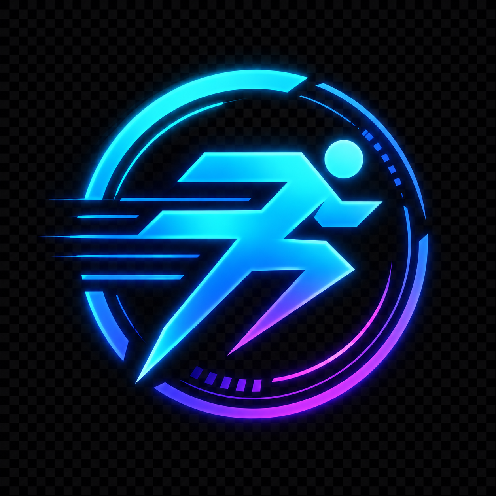

<div align="center">



# Futuristic Vibes — Futuristic Run & Futuristic Bike

### *Run The Future, Shine The Night*

A modern, full-stack event registration platform powering **Futuristic Run 2026** — a night running event with a futuristic neon aesthetic — and **Futuristic Bike 2026**. Built with Next.js 16, powered by InsForge (PostgreSQL), and designed for a seamless mobile-first experience.

[](https://nextjs.org)
[](https://react.dev)
[](https://typescriptlang.org)
[](https://tailwindcss.com)
[](https://prisma.io)
[](https://insforge.dev)
[](https://framer.com/motion)

---

</div>

## ✨ Highlights

- **Immersive Landing Page** — Full-screen hero with particle canvas, neon glow effects, glassmorphism cards, scroll-reveal animations, and a real-time countdown timer
- **Multi-Step Registration** — 3-step form (Personal Data → Race Data → Payment) with real-time validation, localStorage persistence, and inline error handling
- **Admin Dashboard** — Real-time stats, participant management, payment verification (approve/reject), CSV export, and per-event settings panel
- **Multi-Event Architecture** — Database-driven event system supporting multiple events with independent categories, quotas, pricing, and settings
- **Mobile-First Design** — Responsive layouts with breakpoints at 640px and 1024px, optimized touch targets, and accessible form controls
- **Email Notifications** — Automated transactional emails via Resend for registration confirmation, payment verification, and rejection notices

## 🏗️ Architecture

```
┌─────────────────────────────────────────────────────────┐
│                    Next.js 16 App Router                │
│                                                         │
│  ┌──────────┐  ┌──────────┐  ┌──────────────────────┐  │
│  │  Landing  │  │ Register │  │   Admin Dashboard    │  │
│  │  Page     │  │  Form    │  │  (Auth Protected)    │  │
│  └─────┬─────┘  └────┬─────┘  └──────────┬───────────┘  │
│        │              │                   │              │
│  ┌─────┴──────────────┴───────────────────┴──────────┐  │
│  │              API Routes (REST)                     │  │
│  │  /api/register  /api/quota  /api/admin/*           │  │
│  └───────────────────────┬───────────────────────────┘  │
│                          │                              │
│  ┌───────────────────────┴───────────────────────────┐  │
│  │         InsForge SDK  (PostgreSQL + Storage)       │  │
│  │  events · event_categories · participants ·        │  │
│  │  event_settings · admin_users                      │  │
│  └───────────────────────────────────────────────────┘  │
└─────────────────────────────────────────────────────────┘
```

## 🗃️ Database Schema

| Table | Purpose |
|-------|---------|
| `events` | Event definitions (slug, name, theme, dates) |
| `event_categories` | Per-event categories with price, quota, min age |
| `participants` | Full participant records with payment tracking |
| `event_settings` | Key-value settings scoped per event |
| `admin_users` | Admin accounts with bcrypt-hashed passwords |

## 🎨 Design System

| Token | Value | Usage |
|-------|-------|-------|
| `--bg-base` | `#0A0E27` | Deep space navy background |
| `--accent-1` | `#00E5FF` | Neon cyan — primary accent |
| `--accent-2` | `#8B00FF` | Neon purple — secondary |
| `--accent-3` | `#FF006E` | Neon pink — alerts, CTA |
| `--text-accent` | `#FFD700` | Gold — pricing, highlights |

Typography: **Orbitron** (headings) + **Inter** (body) + **Rajdhani** (labels)

Visual language: Glassmorphism cards, neon glow borders, gradient buttons, particle canvas backgrounds, scroll-triggered reveal animations via Framer Motion.

## 📁 Project Structure

```
app-src/
├── src/
│   ├── app/
│   │   ├── page.tsx                  # Landing page
│   │   ├── daftar/page.tsx           # Registration form
│   │   ├── konfirmasi/page.tsx       # Post-registration confirmation
│   │   ├── admin/                    # Dashboard, participants, settings
│   │   └── api/                      # REST API routes
│   ├── components/
│   │   ├── sections/                 # Hero, About, Categories, Jersey, Timeline, Rules, FAQ
│   │   ├── forms/                    # Multi-step registration form
│   │   └── admin/                    # Admin sidebar
│   └── lib/
│       ├── insforge.ts               # InsForge client
│       ├── validations.ts            # Zod schemas
│       ├── email.ts                  # Resend email helpers
│       └── utils.ts                  # Shared utilities
├── prisma/
│   ├── schema.prisma                 # Data model
│   ├── insforge-schema.sql           # PostgreSQL reference schema
│   └── migrations/                   # SQLite migrations
└── migrations/                       # InsForge (PostgreSQL) migrations
```

## 🚀 Tech Stack

| Layer | Technology |
|-------|-----------|
| Framework | Next.js 16 (App Router, Turbopack) |
| UI | React 19, Tailwind CSS 4, Framer Motion |
| Language | TypeScript 5 |
| Database | PostgreSQL via InsForge |
| ORM | Prisma 7 (SQLite for local dev) |
| Auth | NextAuth.js v5 (credentials) |
| Validation | Zod |
| Email | Resend |
| Export | PapaParse (CSV) |
| Icons | Lucide React |

## 📌 Current Events

| Event | Category | Price | Quota |
|-------|----------|-------|-------|
| Futuristic Run 2026 | Run 5K | Rp 200.000 | 200 |
| Futuristic Bike 2026 | Futuristic Bike Ride | Rp 150.000 | 300 |

## 📄 License

This project was developed for **Futuristic Vibes 2026**.

---

<div align="center">

*Built with passion for Futuristic Vibes — Futuristic Run 2026*

</div>
